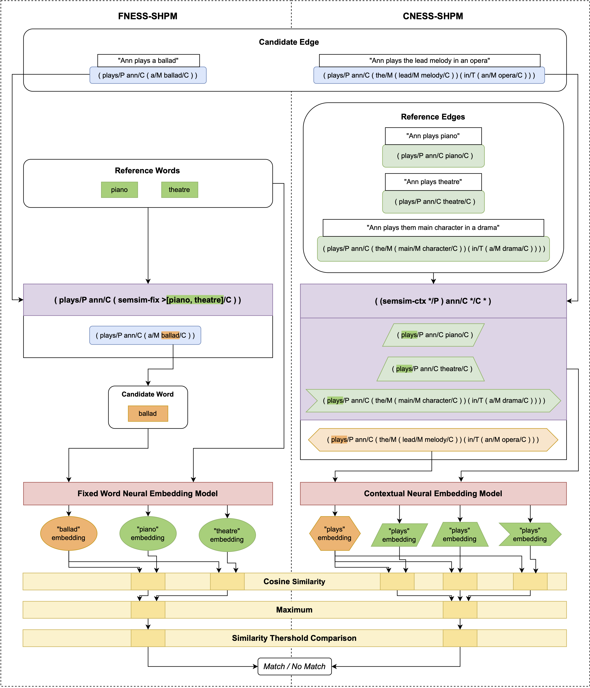
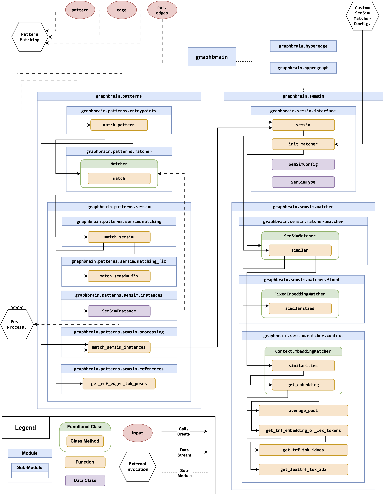

# Extending Semantic Hypergraphs by Neural Embedding-based Semantic Similarity for Pattern Matching
This repository contains the evaluation code, evaluation datasets, and evaluation results - as well as thesis documents - for the following master's thesis in computer science at TU Berlin (in association with the Computation Social Science team at Centre Marc Bloch):  

**"Extending Semantic Hypergraphs by Neural Embedding-based Semantic Similarity for Pattern Matching"** ([PDF](docs/thesis/thesis.pdf)) by Max Reinhard

### Semantic Hypergraph Framework
For background information on the Semantic Hypergraph framework, please refer to the [Graphbrain website](https://graphbrain.net/) and the original publication:  
*Menezes, Telmo and Camille Roth (Feb. 18, 2021). Semantic Hypergraphs. doi: 10.48550/ arXiv.1908.10784. arXiv: 1908.10784 [cs]. url: http://arxiv.org/abs/1908. 10784. preprint.*

## Abstract
This thesis introduces a novel enhancement to the Semantic Hypergraph (SH) framework’s pattern matching capabilities through the integration of Neural Embedding-based Semantic Similarity (NESS). The SH framework utilises a symbolic and structured representation of text, combined with a pattern matching functionality that allows for open and explainable text analysis – particularly aimed at Computational Social Science (CSS) researchers. Originally, the SH pattern matching follows strict, symbolic rules, with limited flexibility in matching the words that are integrated into the structured SH representation. Through incorporation of two NESS variants – Fixed Word Embedding and Contextual Embedding-based measures – the enhancement contributed in this work, allows for more semantically sophisticated patterns and therefore increases adaptivity of the pattern matching process. To provide partial control over the simultaneously introduced opaqueness, we enable users to configure crucial parameters of the NESS measurement. We conducted a comprehensive quantitative evaluation using a newly constructed labeled dataset to test the effectiveness of the NESS integration. The results demonstrate improved retrieval performance of the pattern matching, specifically showcasing the systems ability for contextual differentiation. Moreover, the implementation of the extended SH framework has been designed to be readily usable, facilitating its adoption for practical applications in CSS text analysis.

### Concept Diagram
The following diagram illustrates the concept of *Fixed Neural Embedding-based Semantic Similarity* (FNESS) and *Contextual Neural Embedding-based Semantic Similarity* (CNESS) integration into the SH framework. This is referred to as *Fixed* or *Contextual  Neural Embedding-based Semantic Similarity extended Semantic Hypergraph Pattern Matching* (FNESS-SHPM or CNESS-SHPM).

## Implementation
The implementation of the extended SH framework is available as part of the [`graphbrain` Python library](https://github.com/graphbrain/graphbrain).  
Specifically, the implementation is realised in the ['semsim' branch of the repository](https://github.com/graphbrain/graphbrain/tree/semsim).

### Architecture Diagram
The following diagram illustrates simplified architecture diagram of the modified and extended graphbrain Python package, with primary call chain and data stream for the pattern matching process (return chain is omitted for visual clarity).

